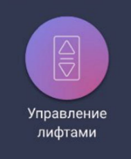
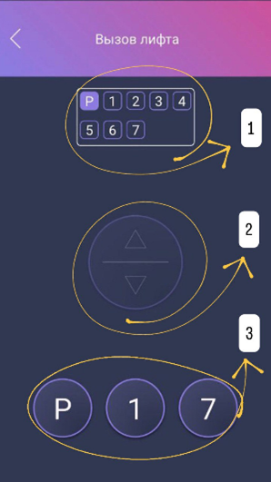
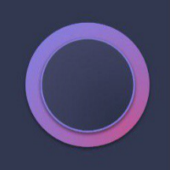

## Вызов лифта с помощью мобильного приложения CleverHome  

*Актуально на 26 марта 2026 г.*

---

📂 *[Посмотреть исходный код на GitHub](https://github.com/eeaspb/my-portfolio)*

📄 *[Открыть инструкцию в формате PDF (для печати)](./Elevator_Call_Manual.pdf)*

---

### Содержание

  - [1. Открытие приложения](#1-открытие-приложения)
  - [2. Описание экрана «Вызов лифта»](#2-описание-экрана-вызов-лифта)
  - [3. Вызов лифта](#3-вызов-лифта)

---

Следуйте инструкции, чтобы вызвать лифт с помощью мобильного приложения **«CleverHome»**.

> Вызов лифта доступен из паркинга, с первого этажа, а также с этажа, на котором находится ваша квартира.  

### 1. Открытие приложения

---

1. Откройте приложение **«CleverHome»**. Откроется главный экран.
2. Внизу экрана потяните вверх розовую шторку. Откроется экран дополнительных функций.
3. Нажмите кнопку **«Управление лифтами»** (рис. 1). Откроется экран **«Вызов лифта»**.     
   
  
  
  *Рис. 1 — Кнопка **«Управление лифтами»***
   
### 2. Описание экрана «Вызов лифта»

---

`1` **Панель этажей с индикатором движения лифта**.  
Показывает, на каком этаже находится лифт. По мере движения лифта подсветка перемещается по этажам.

`2` **Кнопка вызова лифта с указанием направления движения**.  
Используется для вызова лифта и выбора направления, в котором вы собираетесь ехать.

`3` **Кнопка этажа, с которого доступен вызов лифта**.

* `Р` — паркинг;  
* `1` — первый этаж;  
* `7` или другой номер — этаж, на котором расположена ваша квартира.

*Рис. 2 — Экран **«Вызов лифта»***

### 3. Вызов лифта

---

1. Нажмите кнопку этажа, с которого доступен вызов лифта (`Р`, `1` или этаж вашей квартиры). Кнопка загорится розовым.
2. Нажмите кнопку вызова лифта.Кнопка станет розовой, стрелка направления движения — белой.На панели этажей отобразится движение лифта по этажам.  
   
   * *Если вы поедете наверх — нажмите стрелку вверх.*
   * *Если вы поедете вниз — нажмите стрелку вниз.*
  
1. Подождите. Когда лифт окажется на этаже, кнопка вызова лифта станет синей, вокруг загорится сиреневый ободок (рис. 3).

*Рис. 3 — Кнопка вызова лифта*
      
> Если лифт был вызван другим пользователем, то ваш вызов будет поставлен в очередь.
